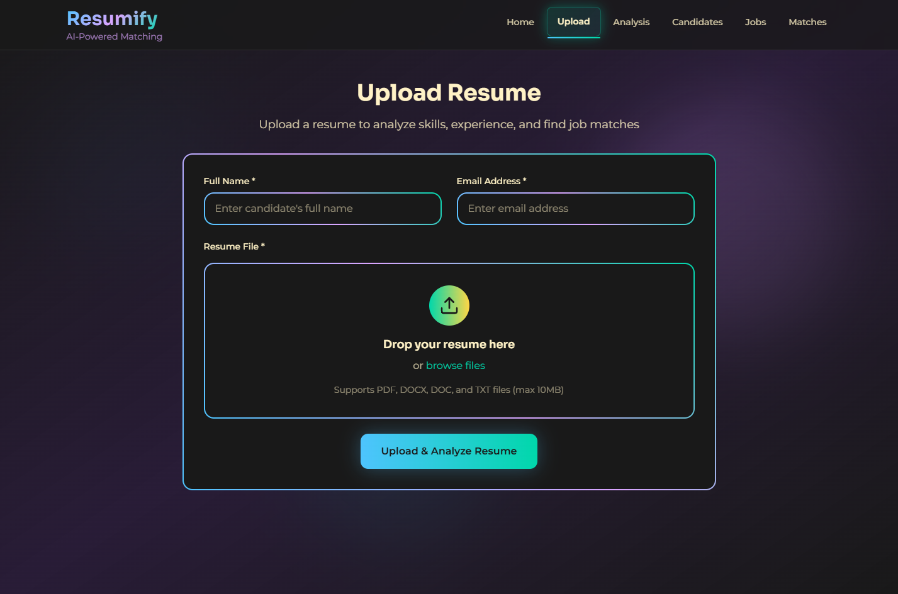
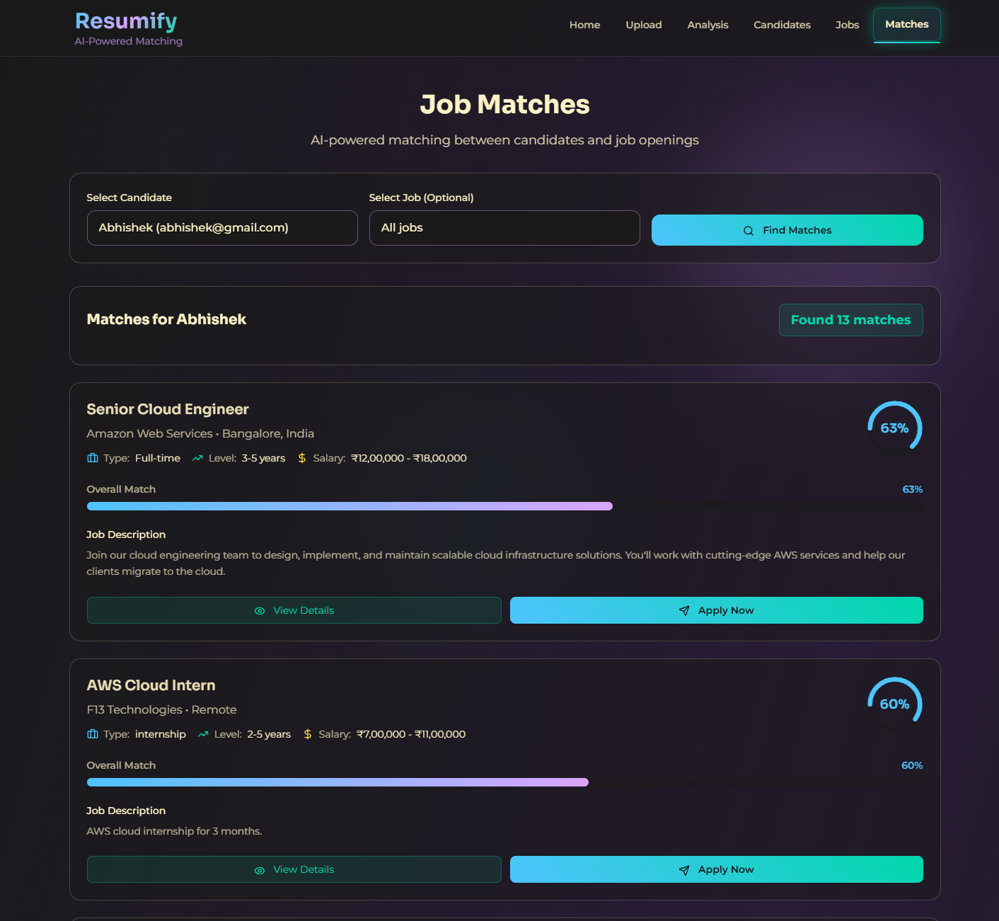
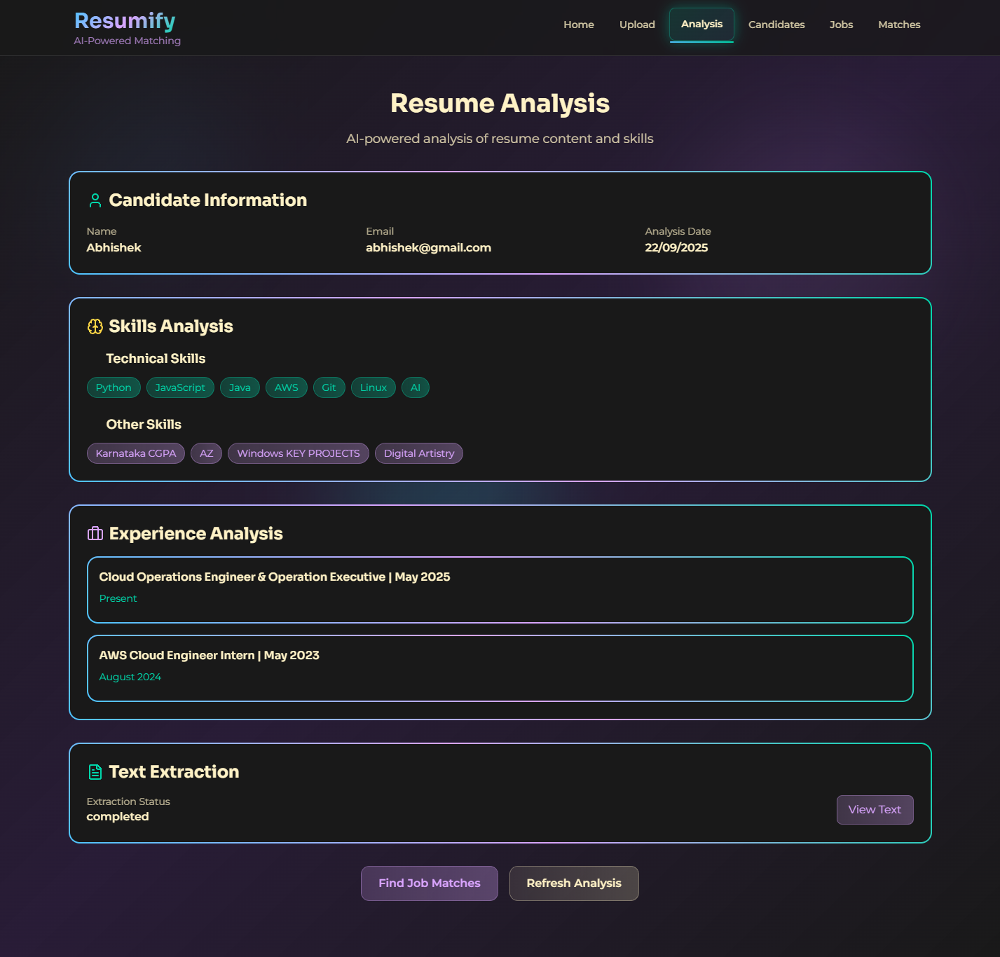

# Resumify – AI-Powered Resume Analysis & Job Matching Platform
[](https://aws.amazon.com/lambda/) [](https://aws.amazon.com/dynamodb/) [](https://aws.amazon.com/textract/) [](https://aws.amazon.com/comprehend/) [](https://developer.mozilla.org/en-US/docs/Web/JavaScript) [](https://www.python.org/) [](https://github.com/nishith-geedh/Resumify) [](LICENSE) [](https://github.com/nishith-geedh/Resumify/commits/main)

---

**Resumify** is a **production-grade, serverless resume analysis and job matching platform** built with **AWS serverless architecture** and **modern web technologies**. It provides comprehensive resume processing, AI-powered analysis, and intelligent job matching with a beautiful, responsive UI that works seamlessly across all devices.


---

## Table of Contents

- [✨ Features](#-features)
- [🏗️ Architecture](#️-architecture)
- [📂 Project Structure](#-project-structure)
- [🚀 Quick Start](#-quick-start)
- [🔧 Prerequisites](#-prerequisites)
- [📋 Backend Deployment (AWS SAM)](#-backend-deployment-aws-sam)
- [🎨 Frontend Setup](#-frontend-setup)
- [🌐 Production Deployment](#-production-deployment)
- [🔑 Environment Variables](#-environment-variables)
- [📊 API Endpoints](#-api-endpoints)
- [🎯 Key Features Deep Dive](#-key-features-deep-dive)
- [💡 Advanced Features](#-advanced-features)
- [🔒 Security & Authentication](#-security--authentication)
- [📈 Cost & Scalability](#-cost--scalability)
- [🛠️ Development & Testing](#️-development--testing)
- [🐛 Troubleshooting](#-troubleshooting)
- [🤝 Contributing](#-contributing)
- [📜 License](#-license)

---

## ✨ Features

### 🎨 **Modern UI/UX**
- **Glassmorphism Design** with Sora fonts and multi-color theme
- **Responsive Design** with smooth animations and hover effects
- **Real-time Progress Tracking** with adaptive progress bars
- **Mobile-First** approach with touch-friendly interfaces
- **Accessibility Features** with WCAG compliance and keyboard navigation

### 📄 **Smart Resume Processing**
- **Multi-format Support**: PDF (AWS Textract), DOCX (python-docx), DOC (antiword), TXT files
- **Intelligent Text Extraction** with OCR for scanned PDFs
- **File Validation** with size limits (10MB) and type checking
- **Secure Storage** in AWS S3 with server-side encryption
- **Real-time Status Updates** with progress indicators

### 🤖 **AI-Powered Analysis**
- **Amazon Comprehend Integration** for NLP analysis
- **Skill Extraction** with technical and soft skills categorization
- **Experience Analysis** with job titles and company extraction
- **Entity Recognition** for names, organizations, and locations
- **Confidence Scoring** for extracted information accuracy

### 🎯 **Intelligent Job Matching**
- **Jaccard Similarity Algorithm** for skill-based matching
- **Advanced Scoring System** with experience and confidence weighting
- **Real-time Match Calculation** with instant results
- **Match Explanations** showing matching and missing skills
- **Filtering Options** by company, job type, and match percentage

### 📊 **Comprehensive Analytics**
- **Candidate Dashboard** with processing status and analytics
- **Job Management** with CRUD operations for job postings
- **Match Analytics** with detailed scoring breakdowns
- **Real-time Updates** with automatic data refresh
- **Export Functionality** for analysis results

### ☁️ **Serverless Architecture**
- **AWS Lambda** functions for backend logic (Python 3.10)
- **DynamoDB** for scalable NoSQL data storage
- **API Gateway** for RESTful API endpoints with CORS
- **S3** for secure file storage with lifecycle policies
- **SNS** for asynchronous event processing
- **Auto-scaling** infrastructure with pay-per-use pricing

## 🏗️ Architecture

### **High-Level Architecture Overview**


```
┌─────────────────┐    ┌──────────────────┐    ┌─────────────────┐
│   Frontend      │    │   API Gateway    │    │   Lambda        │
│   (Static Web)  │◄──►│   (REST API)     │◄──►│   Functions     │
└─────────────────┘    └──────────────────┘    └─────────────────┘
                                                         │
                       ┌──────────────────┐             │
                       │   CloudWatch     │◄────────────┤
                       │   (Logging)      │             │
                       └──────────────────┘             │
                                                         │
┌─────────────────┐    ┌──────────────────┐             │
│   S3 Bucket     │◄───│   DynamoDB       │◄────────────┘
│   (File Storage)│    │   (Database)     │
└─────────────────┘    └──────────────────┘
         │
         ▼
┌─────────────────┐
│   AWS Textract  │
│   (OCR Service) │
└─────────────────┘
```

### **Detailed Component Architecture**

#### **Frontend Layer (Modern Web Application)**
- **HTML5 Pages**: Landing, Upload, Candidates, Jobs, Matches, Analysis
- **JavaScript Modules**: API client, upload handler, real-time monitoring
- **CSS Styling**: Glassmorphism effects, animations, responsive design
- **Real-time Features**: Progress tracking, status updates, live data refresh

#### **API Gateway Layer (AWS API Gateway)**
- **REST API v1** with CORS enabled for cross-origin requests
- **HTTP Methods**: GET, POST, PUT, DELETE with proper routing
- **Request Validation**: File type and size validation
- **Error Handling**: Standardized error responses with proper HTTP codes
- **Rate Limiting**: Built-in throttling and request limits

#### **Lambda Functions Layer (AWS Lambda)**
- **Upload Handler**: File upload processing, S3 storage, candidate creation
- **DOCX/DOC Worker**: Text extraction from Microsoft Office documents
- **Textract Result Handler**: PDF OCR processing and text extraction
- **NLP Handler**: AI-powered analysis using Amazon Comprehend
- **Analysis Handler**: Analysis data retrieval and formatting
- **Candidates Handler**: Candidate data management
- **Jobs Handler**: Job posting CRUD operations
- **Matches Handler**: Job-candidate matching algorithm

#### **Storage Layer (AWS Services)**
- **S3 Bucket**: Secure resume file storage with encryption
- **DynamoDB Tables**: 
  - Candidates: User and resume metadata
  - Analyses: AI analysis results and extracted data
  - Jobs: Job postings and requirements
  - Matches: Match results and scoring

#### **External Services Integration**
- **AWS Textract**: OCR for PDF text extraction
- **Amazon Comprehend**: NLP for entity and key phrase extraction
- **SNS**: Asynchronous event notifications
- **CloudWatch**: Logging, monitoring, and metrics

#### **Security & IAM**
- **IAM Roles**: Least privilege access for each service
- **S3 Security**: Private buckets with encryption
- **DynamoDB Security**: Encryption at rest and in transit
- **API Security**: CORS configuration and input validation

## 📂 Project Structure

```
Resumify/
│
├── 📁 backend/                          # AWS SAM Backend
│   ├── 📄 template.yaml                 # SAM template for infrastructure
│   ├── 📄 samconfig.toml               # SAM deployment configuration
│   ├── 📁 layers/                      # Lambda layers
│   │   └── 📁 antiword/               # Antiword binary for DOC processing
│   │       └── 📁 bin/
│   │           └── 📄 antiword         # Binary executable
│   └── 📁 src/                         # Lambda function source code
│       ├── 📁 upload_handler/          # File upload processing
│       │   ├── 📄 app.py              # Main handler function
│       │   ├── 📄 requirements.txt    # Python dependencies
│       │   └── 📄 upload_handler.zip  # Deployment package
│       ├── 📁 docx_txt_worker/         # DOCX/DOC text extraction
│       │   ├── 📄 app.py              # Main handler function
│       │   ├── 📄 requirements.txt    # Python dependencies
│       │   └── 📄 six.py             # Python 2/3 compatibility
│       ├── 📁 textract_result_handler/ # PDF OCR result processing
│       │   ├── 📄 app.py              # Main handler function
│       │   └── 📄 requirements.txt    # Python dependencies
│       ├── 📁 nlp_handler/             # AI analysis with Comprehend
│       │   ├── 📄 app.py              # Main handler function
│       │   ├── 📄 requirements.txt    # Python dependencies
│       │   └── 📁 cloudwatch_logger.py # Logging utilities
│       ├── 📁 analysis_handler/        # Analysis data retrieval
│       │   ├── 📄 app.py              # Main handler function
│       │   ├── 📄 enhanced_app.py     # Enhanced version
│       │   └── 📄 requirements.txt    # Python dependencies
│       ├── 📁 candidates_handler/      # Candidate data management
│       │   ├── 📄 app.py              # Main handler function
│       │   └── 📄 requirements.txt    # Python dependencies
│       ├── 📁 jobs_handler/            # Job posting management
│       │   ├── 📄 app.py              # Main handler function
│       │   ├── 📄 app_minimal.py      # Minimal version
│       │   └── 📄 requirements.txt    # Python dependencies
│       ├── 📁 matches_handler/         # Job matching algorithm
│       │   ├── 📄 app.py              # Main handler function
│       │   ├── 📄 app_minimal.py      # Minimal version
│       │   └── 📄 requirements.txt    # Python dependencies
│       └── 📁 shared/                  # Shared utilities
│           ├── 📄 cloudwatch_logger.py # Logging utilities
│           ├── 📄 cors_utils.py        # CORS helper functions
│           ├── 📄 error_handler.py     # Error handling utilities
│           └── 📄 monitoring_utils.py  # Monitoring utilities
│
├── 📁 frontend/                         # Modern Web Frontend
│   ├── 📄 package.json                 # Frontend dependencies
│   ├── 📄 config.js                    # Application configuration
│   ├── 📄 index.html                   # Landing page
│   ├── 📄 upload.html                  # File upload page
│   ├── 📄 candidates.html              # Candidates management page
│   ├── 📄 jobs.html                    # Jobs management page
│   ├── 📄 matches.html                 # Job matching page
│   ├── 📄 analysis.html                # Analysis results page
│   ├── 📁 js/                          # JavaScript modules
│   │   ├── 📄 api.js                   # API client with authentication
│   │   ├── 📄 upload.js                # File upload handling
│   │   ├── 📄 navigation.js            # Page navigation
│   │   ├── 📄 realtime-data-updates.js # Real-time data refresh
│   │   ├── 📄 realtime-text-extraction.js # Status monitoring
│   │   ├── 📄 dropdown-enhancements.js # UI enhancements
│   │   ├── 📄 error-handling.js        # Error management
│   │   ├── 📄 loading-states.js        # Loading state management
│   │   └── 📄 api-status.js            # API health monitoring
│   ├── 📁 styles/                      # CSS styling
│   │   ├── 📄 main.css                 # Core styles and theme
│   │   ├── 📄 components.css           # Component-specific styles
│   │   ├── 📄 animations.css           # Animation definitions
│   │   ├── 📄 navigation.css           # Navigation styles
│   │   ├── 📄 pages.css                # Page-specific styles
│   │   ├── 📄 upload.css               # Upload page styles
│   │   └── 📄 dropdown-fixes.css       # Dropdown enhancements
│   └── 📁 node_modules/                # Frontend dependencies
│
├── 📁 demo/                            # Demo screenshots and images
│   ├── 📄 landing page.png             # Landing page screenshot
│   ├── 📄 127.0.0.1_3000_upload.html*.png # Upload page screenshots
│   ├── 📄 127.0.0.1_3000_candidates.html*.png # Candidates page screenshots
│   ├── 📄 127.0.0.1_3000_jobs.html*.png # Jobs page screenshots
│   ├── 📄 127.0.0.1_3000_matches.html*.png # Matches page screenshots
│   ├── 📄 127.0.0.1_3000_analysis.html*.png # Analysis page screenshots
│   ├── 📄 api gateway.png              # AWS API Gateway console
│   ├── 📄 lambda functions.png         # AWS Lambda console
│   ├── 📄 dynamodb tables.png          # DynamoDB console overview
│   ├── 📄 dynamodb_*.png               # Individual DynamoDB tables
│   ├── 📄 s3 bucket.png                # S3 console
│   └── 📄 cloudwatch logs.png          # CloudWatch logs
│
├── 📁 docs/                            # Documentation
│   ├── 📄 ARCHITECTURE.md              # Detailed architecture documentation
│   ├── 📄 API.md                       # API documentation
│   ├── 📄 DEPLOYMENT.md                # Deployment guide
│   ├── 📄 FILE_FORMAT_SUPPORT.md       # File format support details
│   └── 📄 Resumify-AI-Powered-Resume-Analysis-and-Job-Matching-Platform.pdf # Project documentation
│
├── 📁 sample resumes/                  # Sample resume files for testing
│   ├── 📄 abhishek_bagade_resume.txt   # Sample TXT resume
│   ├── 📄 aman_sharma_resume.pdf       # Sample PDF resume
│   └── 📄 jane_doe_resume.docx         # Sample DOCX resume
│
├── 📄 README.md                        # This file
├── 📄 architecture_diagram.dot         # Graphviz architecture diagram
└── 📄 .gitignore                       # Git ignore rules
```

---

## 🚀 Quick Start

### 🔧 Prerequisites

- **AWS Account** with appropriate permissions for Lambda, DynamoDB, S3, Textract, Comprehend
- **AWS CLI** configured with credentials (`aws configure`)
- **AWS SAM CLI** installed for backend deployment
- **Node.js** 16+ and npm for frontend development
- **Python** 3.10+ for local development
- **Git** for version control

### 📋 Backend Deployment (AWS SAM)

1. **Clone the repository**
   ```bash
   git clone https://github.com/nishith-geedh/Resumify.git
   cd Resumify
   ```

2. **Deploy backend infrastructure**
   ```bash
   cd backend
   sam build
   sam deploy --guided
   ```

3. **Configure deployment parameters**
   ```
   Stack Name: resumify-simple-ap-south-1
   AWS Region: ap-south-1 (or your preferred region)
   Parameter Environment: dev
   Confirm changes before deploy: Y
   Allow SAM CLI IAM role creation: Y
   Save parameters to configuration file: Y
   ```

4. **Note the deployment outputs**
   - API Gateway URL: `https://yri860154k.execute-api.ap-south-1.amazonaws.com/dev`
   - S3 Bucket Name: `resumify-resumes-925529666302-ap-south-1-dev`
   - DynamoDB Table Names: `Resumify_Candidates_dev`, `Resumify_Analyses_dev`, etc.


### 🎨 Frontend Setup

1. **Install dependencies**
   ```bash
   cd frontend
   npm install
   ```

2. **Configure API endpoint**
   Update `frontend/config.js` with your API Gateway URL:
   ```javascript
   const CONFIG = {
       API_BASE_URL: 'https://yri860154k.execute-api.ap-south-1.amazonaws.com/dev',
       // ... rest of configuration
   };
   ```

3. **Start development server**
   ```bash
   npm run dev
   ```

4. **Access the application**
   - **Development**: [http://localhost:3000](http://localhost:3000)
   - **Production**: Your deployed frontend URL


### 🌐 Production Deployment

#### **Option 1: AWS Amplify (Recommended)**

1. **Connect GitHub repository** to AWS Amplify
2. **Configure build settings**:
   ```yaml
   version: 1
   frontend:
     phases:
       preBuild:
         commands:
           - npm install
       build:
         commands:
           - npm run build
     artifacts:
       baseDirectory: .
       files:
         - '**/*'
     cache:
       paths:
         - node_modules/**/*
   ```

3. **Set environment variables** in Amplify console
4. **Deploy** and get your production URL

#### **Option 2: Static Hosting**

1. **Build the application**
   ```bash
   cd frontend
   npm run build
   ```

2. **Deploy to any static hosting service**
   - AWS S3 + CloudFront
   - Netlify
   - Vercel
   - GitHub Pages

---

## 🔑 Environment Variables

### **Backend (SAM Template)**
```yaml
Environment:
  Variables:
    CANDIDATES_TABLE: Resumify_Candidates_dev
    ANALYSES_TABLE: Resumify_Analyses_dev
    JOBS_TABLE: Resumify_Jobs_dev
    MATCHES_TABLE: Resumify_Matches_dev
    RESUMES_BUCKET: resumify-resumes-925529666302-ap-south-1-dev
    ENABLE_ENHANCED_MONITORING: "true"
    LOG_LEVEL: "INFO"
```

### **Frontend (config.js)**
```javascript
const CONFIG = {
    API_BASE_URL: 'https://yri860154k.execute-api.ap-south-1.amazonaws.com/dev',
    THEME: {
        colors: {
            primary: '#6366f1',
            secondary: '#8b5cf6',
            accent: '#f59e0b',
            success: '#10b981',
            warning: '#f59e0b',
            error: '#ef4444'
        }
    },
    FEATURES: {
        realtimeUpdates: true,
        progressTracking: true,
        fileValidation: true,
        exportFunctionality: true
    }
};
```

---

## 📊 API Endpoints

### **File Upload**
```
POST   /upload                    # Upload resume file
       Content-Type: multipart/form-data
       Body: {file, name, email}
```

### **Analysis & Candidates**
```
GET    /analysis?candidateId={id} # Get analysis results
GET    /candidates                # Get all candidates
```

### **Jobs Management**
```
GET    /jobs                      # Get all jobs
POST   /jobs                      # Create new job
PUT    /jobs/{id}                 # Update job
DELETE /jobs/{id}                 # Delete job
```

### **Job Matching**
```
GET    /matches?candidateId={id}  # Get job matches for candidate
GET    /matches?candidateId={id}&jobId={id} # Get specific match
```

### **AI Analysis**
```
POST   /analyze                   # Trigger re-analysis
       Body: {candidateId}
```

---

## 🎯 Key Features Deep Dive

### **📄 Smart Resume Processing**

#### **Multi-format File Support**
- **PDF Files**: AWS Textract OCR processing for scanned documents
- **DOCX Files**: python-docx library for Microsoft Word documents
- **DOC Files**: antiword binary for legacy Word documents
- **TXT Files**: Direct text processing for plain text resumes



#### **Intelligent Text Extraction**
- **OCR Processing**: Multi-page PDF support with confidence scoring
- **Format Preservation**: Maintains document structure and formatting
- **Error Handling**: Graceful fallbacks for corrupted or unsupported files
- **Progress Tracking**: Real-time status updates during processing

#### **File Validation & Security**
- **Size Limits**: 10MB maximum file size
- **Type Validation**: Strict file type checking
- **Virus Scanning**: Optional integration with AWS GuardDuty
- **Encryption**: Server-side encryption for all stored files

### **🤖 AI-Powered Analysis**

#### **Amazon Comprehend Integration**
- **Entity Recognition**: Names, organizations, locations, dates
- **Key Phrase Extraction**: Skills, technologies, achievements
- **Sentiment Analysis**: Tone and confidence scoring
- **Custom Classifiers**: Industry-specific skill categorization

#### **Skill Extraction & Categorization**
- **Technical Skills**: Programming languages, frameworks, tools
- **Soft Skills**: Leadership, communication, teamwork
- **Industry Knowledge**: Domain-specific expertise
- **Experience Levels**: Junior, mid-level, senior classifications

#### **Experience Analysis**
- **Job Title Extraction**: Current and previous positions
- **Company Recognition**: Organization names and industries
- **Duration Calculation**: Years of experience estimation
- **Achievement Parsing**: Accomplishments and responsibilities

### **🎯 Intelligent Job Matching**

#### **Jaccard Similarity Algorithm**
```python
def calculate_match_score(candidate_skills, job_skills):
    intersection = set(candidate_skills) & set(job_skills)
    union = set(candidate_skills) | set(job_skills)
    jaccard_score = len(intersection) / len(union) if union else 0
    return jaccard_score * 100
```

#### **Advanced Scoring Factors**
- **Skill Matching**: Exact and fuzzy skill matching
- **Experience Weighting**: Years of experience bonus
- **Confidence Scoring**: AI confidence in extracted data
- **Category Prioritization**: Technical skills weighted higher for technical roles



### **📊 Comprehensive Analytics Dashboard**

#### **Candidate Management**
- **Processing Status**: Real-time status tracking
- **Analysis Results**: Skills, experience, and qualifications
- **Match History**: Previous job matches and scores
- **Export Functionality**: Download analysis data

.png)

#### **Job Management**
- **CRUD Operations**: Create, read, update, delete jobs
- **Requirement Management**: Skills, experience, location
- **Match Analytics**: Candidate compatibility scores
- **Bulk Operations**: Import/export job data

.png)

#### **Analysis Results**
- **Detailed Breakdown**: Skills analysis with confidence scores
- **Experience Summary**: Job history and career progression
- **Match Explanations**: Why candidates match specific jobs
- **Visual Analytics**: Charts and graphs for data insights



---

---

## 💡 Advanced Features

### **🔄 Real-time Processing Pipeline**

#### **Event-Driven Architecture**
- **SNS Notifications**: Asynchronous event processing
- **Lambda Triggers**: Automatic function invocation
- **Status Updates**: Real-time progress tracking
- **Error Recovery**: Automatic retry mechanisms

#### **Progress Tracking**
- **Adaptive Progress Bars**: Dynamic progress indicators
- **Status Messages**: User-friendly status descriptions
- **Time Estimation**: Processing time predictions
- **Cancellation Support**: Ability to cancel long-running jobs

### **📱 Mobile Optimization**

#### **Responsive Design**
- **Mobile-First**: Optimized for mobile devices
- **Touch Interactions**: Touch-friendly interface elements
- **Adaptive Layouts**: Dynamic layout adjustments
- **Performance Optimization**: Fast loading on mobile networks

#### **Progressive Web App Features**
- **Offline Support**: Basic functionality without internet
- **Push Notifications**: Processing completion alerts
- **App-like Experience**: Native app feel in browser
- **Installation Support**: Add to home screen functionality

### **🔔 Smart Notifications**

#### **Processing Alerts**
- **Upload Confirmation**: File upload success notifications
- **Processing Updates**: Real-time status updates
- **Completion Alerts**: Analysis completion notifications
- **Error Notifications**: Clear error messages and solutions

#### **Match Notifications**
- **New Matches**: Alert for new job matches
- **High-Score Matches**: Notifications for excellent matches
- **Match Updates**: Changes in match scores
- **Recommendation Alerts**: Suggested actions and improvements

### **📊 Advanced Analytics**

#### **Data Visualization**
- **Interactive Charts**: Dynamic charts with drill-down capabilities
- **Trend Analysis**: Historical data and trend identification
- **Comparative Analysis**: Side-by-side candidate comparisons
- **Export Options**: Multiple export formats (JSON, CSV, PDF)

#### **Business Intelligence**
- **Hiring Insights**: Industry trends and patterns
- **Skill Gap Analysis**: Missing skills identification
- **Market Intelligence**: Salary and demand insights
- **Predictive Analytics**: Future trend predictions

---

## 🔒 Security & Authentication

### **Data Protection**

#### **Encryption**
- **At Rest**: DynamoDB and S3 encryption
- **In Transit**: HTTPS/TLS for all communications
- **Application Level**: Sensitive data encryption
- **Key Management**: AWS KMS for encryption keys

#### **Access Control**
- **IAM Roles**: Least privilege access principles
- **Resource Policies**: Service-specific permissions
- **Network Security**: VPC endpoints for private access
- **Audit Logging**: CloudTrail for access monitoring


### **Input Validation & Sanitization**

#### **File Security**
- **Type Validation**: Strict file type checking
- **Size Limits**: Maximum file size enforcement
- **Content Scanning**: Malicious content detection
- **Virus Protection**: Integration with AWS GuardDuty

#### **API Security**
- **Input Validation**: Server-side validation for all inputs
- **SQL Injection Prevention**: Parameterized queries
- **XSS Protection**: Output encoding and sanitization
- **Rate Limiting**: API throttling and abuse prevention

### **Compliance & Privacy**

#### **Data Privacy**
- **GDPR Compliance**: Data protection and privacy rights
- **Data Retention**: Configurable data retention policies
- **Right to Erasure**: Data deletion capabilities
- **Data Portability**: Export functionality for user data

#### **Audit & Monitoring**
- **CloudTrail**: API call logging and monitoring
- **CloudWatch**: Application and infrastructure monitoring
- **Security Monitoring**: Real-time security event detection
- **Compliance Reporting**: Automated compliance reports

---

## 📈 Cost & Scalability

### **AWS Service Costs (Estimated)**

| Service | Purpose | Cost (per month) | Scalability |
|---------|---------|------------------|-------------|
| **Lambda** | Backend functions | $5-15 (execution time) | Auto-scaling to thousands |
| **DynamoDB** | Data storage | $3-8 (on-demand pricing) | Unlimited scaling |
| **S3** | File storage | $1-4 (storage + requests) | Unlimited storage |
| **Textract** | PDF OCR | $15-30 (per page) | Auto-scaling |
| **Comprehend** | NLP analysis | $8-20 (per request) | Auto-scaling |
| **API Gateway** | API endpoints | $2-5 (requests) | Auto-scaling |
| **SNS** | Notifications | $0.50-2 (messages) | Auto-scaling |

**Total Estimated Cost**: $35-85/month for moderate usage (100-500 resumes)

### **Scaling Characteristics**

#### **Automatic Scaling**
- **Lambda**: Scales from 0 to thousands of concurrent executions
- **DynamoDB**: On-demand scaling with no capacity planning
- **S3**: Unlimited storage with global availability
- **API Gateway**: Handles millions of requests per second

#### **Performance Optimization**
- **Cold Start Mitigation**: Provisioned concurrency for critical functions
- **Caching**: DynamoDB DAX for frequently accessed data
- **CDN**: CloudFront for global content delivery
- **Connection Pooling**: Efficient database connections

### **Cost Optimization Strategies**

#### **Resource Optimization**
- **Right-sizing**: Optimal memory allocation for Lambda functions
- **Reserved Capacity**: Reserved DynamoDB capacity for predictable workloads
- **Lifecycle Policies**: S3 lifecycle policies for cost optimization
- **Monitoring**: CloudWatch for cost and usage monitoring

#### **Usage Optimization**
- **Batch Processing**: Efficient batch operations
- **Caching**: Reduce redundant API calls
- **Data Compression**: Compress stored data
- **Archival**: Move old data to cheaper storage classes

---

## 🛠️ Development & Testing

### **Local Development Setup**

#### **Backend Development**
```bash
# Install dependencies
pip install -r requirements.txt

# Run local API
sam local start-api

# Test specific function
sam local invoke UploadHandlerFunction --event test-payload.json

# Debug with logs
sam local invoke UploadHandlerFunction --event test-payload.json --log-file debug.log
```

#### **Frontend Development**
```bash
# Install dependencies
npm install

# Start development server
npm run dev

# Run linting
npm run lint

# Build for production
npm run build
```

### **Testing Framework**

#### **Unit Testing**
```bash
# Backend tests
cd backend
python -m pytest tests/

# Frontend tests
cd frontend
npm test
```

#### **Integration Testing**
```bash
# Test API endpoints
python tests/test_api_integration.py

# Test file upload
python tests/test_file_upload.py

# Test job matching
python tests/test_matching_algorithm.py
```

### **API Testing**

#### **Manual Testing**
```bash
# Test upload endpoint
curl -X POST https://your-api-url/upload \
  -F "file=@sample_resume.pdf" \
  -F "name=John Doe" \
  -F "email=john@example.com"

# Test analysis endpoint
curl -X GET "https://your-api-url/analysis?candidateId=123"

# Test matches endpoint
curl -X GET "https://your-api-url/matches?candidateId=123"
```

#### **Automated Testing**
```bash
# Run full test suite
python tests/run_all_tests.py

# Test specific component
python tests/test_nlp_processing.py

# Performance testing
python tests/test_performance.py
```

---

## 🧪 Testing

Run the test suite to verify your deployment:

```bash
cd tests
python test_upload.py
```

The test will:
1. Create sample job postings
2. Upload a test resume
3. Wait for AI analysis to complete
4. Generate job matches
5. Display results

---

## 🐛 Troubleshooting

### **Common Issues & Solutions**

#### **File Upload Issues**

**Issue**: File upload fails with 413 Payload Too Large
```bash
# Solution: Check file size limits
# Update API Gateway payload size limit
aws apigateway update-rest-api --rest-api-id YOUR_API_ID --patch-ops op=replace,path=/minimumCompressionSize,value=1048576
```

**Issue**: CORS errors during file upload
```bash
# Solution: Verify CORS configuration
# Check API Gateway CORS settings in AWS console
```

#### **Processing Issues**

**Issue**: PDF processing stuck at 0%
```bash
# Solution: Check Textract service status
aws textract get-document-text-detection --job-id YOUR_JOB_ID

# Check Lambda function logs
sam logs -n TextractResultHandlerFunction --stack-name resumify-dev --tail
```

**Issue**: DOCX files not processing
```bash
# Solution: Verify python-docx installation
pip install python-docx

# Check Lambda function dependencies
sam build --use-container
```

#### **Database Issues**

**Issue**: DynamoDB throttling errors
```bash
# Solution: Switch to on-demand billing
aws dynamodb update-table --table-name Resumify_Candidates_dev --billing-mode PAY_PER_REQUEST
```

**Issue**: Analysis data not found (404 errors)
```bash
# Solution: Check DynamoDB table configuration
aws dynamodb describe-table --table-name Resumify_Analyses_dev

# Verify Global Secondary Index
aws dynamodb describe-table --table-name Resumify_Analyses_dev --query 'Table.GlobalSecondaryIndexes'
```

### **Debug Commands**

#### **Lambda Function Debugging**
```bash
# View function logs
sam logs -n UploadHandlerFunction --stack-name resumify-dev --tail

# Test function locally
sam local invoke UploadHandlerFunction --event test-events/upload-event.json

# Debug with X-Ray tracing
sam local invoke UploadHandlerFunction --event test-events/upload-event.json --debug
```

#### **API Gateway Debugging**
```bash
# Test API endpoint
curl -v https://your-api-url/upload

# Check API Gateway logs
aws logs describe-log-groups --log-group-name-prefix /aws/apigateway

# Monitor API metrics
aws cloudwatch get-metric-statistics --namespace AWS/ApiGateway --metric-name Count --dimensions Name=ApiName,Value=your-api-name --start-time 2024-01-01T00:00:00Z --end-time 2024-01-02T00:00:00Z --period 3600 --statistics Sum
```

#### **DynamoDB Debugging**
```bash
# Check table status
aws dynamodb describe-table --table-name Resumify_Candidates_dev

# Query specific item
aws dynamodb get-item --table-name Resumify_Candidates_dev --key '{"candidateId":{"S":"your-candidate-id"}}'

# Scan table contents
aws dynamodb scan --table-name Resumify_Candidates_dev --limit 10
```

### **Performance Monitoring**

#### **CloudWatch Metrics**
```bash
# Lambda function metrics
aws cloudwatch get-metric-statistics --namespace AWS/Lambda --metric-name Duration --dimensions Name=FunctionName,Value=UploadHandlerFunction --start-time 2024-01-01T00:00:00Z --end-time 2024-01-02T00:00:00Z --period 3600 --statistics Average

# DynamoDB metrics
aws cloudwatch get-metric-statistics --namespace AWS/DynamoDB --metric-name ConsumedReadCapacityUnits --dimensions Name=TableName,Value=Resumify_Candidates_dev --start-time 2024-01-01T00:00:00Z --end-time 2024-01-02T00:00:00Z --period 3600 --statistics Sum
```

#### **Application Monitoring**
```bash
# Set up CloudWatch alarms
aws cloudwatch put-metric-alarm --alarm-name "High Lambda Errors" --alarm-description "Alert when Lambda errors exceed threshold" --metric-name Errors --namespace AWS/Lambda --statistic Sum --period 300 --threshold 5 --comparison-operator GreaterThanThreshold --dimensions Name=FunctionName,Value=UploadHandlerFunction

# Monitor API Gateway errors
aws cloudwatch put-metric-alarm --alarm-name "API Gateway 4XX Errors" --alarm-description "Alert when 4XX errors exceed threshold" --metric-name 4XXError --namespace AWS/ApiGateway --statistic Sum --period 300 --threshold 10 --comparison-operator GreaterThanThreshold
```

---

## 🤝 Contributing

We welcome contributions from the community! Please follow these guidelines:

### **Getting Started**

1. **Fork the repository**
   ```bash
   git clone https://github.com/nishith-geedh/Resumify.git
   cd Resumify
   ```

2. **Create a feature branch**
   ```bash
   git checkout -b feature/amazing-feature
   ```

3. **Make your changes**
   - Follow existing code style and patterns
   - Add tests for new functionality
   - Update documentation as needed

4. **Test your changes**
   ```bash
   # Backend tests
   cd backend && python -m pytest tests/
   
   # Frontend tests
   cd frontend && npm test
   ```

5. **Commit your changes**
   ```bash
   git commit -m "Add amazing feature"
   ```

6. **Push to your branch**
   ```bash
   git push origin feature/amazing-feature
   ```

7. **Open a Pull Request**

### **Development Guidelines**

#### **Code Style**
- **Python**: Follow PEP 8 guidelines
- **JavaScript**: Use ESLint configuration
- **CSS**: Follow BEM methodology
- **Documentation**: Update README and API docs

#### **Testing Requirements**
- **Unit Tests**: Test individual functions and components
- **Integration Tests**: Test API endpoints and workflows
- **End-to-End Tests**: Test complete user workflows
- **Performance Tests**: Ensure scalability requirements

#### **Documentation**
- **Code Comments**: Explain complex logic and algorithms
- **API Documentation**: Document all endpoints and parameters
- **User Documentation**: Update user guides and tutorials
- **Architecture Documentation**: Document system design changes

### **Issue Reporting**

#### **Bug Reports**
When reporting bugs, please include:
- **Environment**: OS, browser, AWS region
- **Steps to Reproduce**: Detailed reproduction steps
- **Expected Behavior**: What should happen
- **Actual Behavior**: What actually happens
- **Logs**: Relevant error logs and stack traces
- **Screenshots**: Visual evidence when applicable

#### **Feature Requests**
For feature requests, please include:
- **Use Case**: Why this feature is needed
- **Proposed Solution**: How you envision the feature
- **Alternatives**: Other approaches you've considered
- **Additional Context**: Any other relevant information

### **Pull Request Process**

1. **Ensure tests pass**: All tests must pass before merging
2. **Update documentation**: Update relevant documentation
3. **Follow naming conventions**: Use clear, descriptive names
4. **Write clear commit messages**: Explain what and why
5. **Request review**: Ask for review from maintainers
6. **Address feedback**: Respond to review comments promptly

---

## 📜 License

This project is licensed under the MIT License - see the [LICENSE](LICENSE) file for details.

### **MIT License**

```
MIT License

Copyright (c) 2024 Resumify Team

Permission is hereby granted, free of charge, to any person obtaining a copy
of this software and associated documentation files (the "Software"), to deal
in the Software without restriction, including without limitation the rights
to use, copy, modify, merge, publish, distribute, sublicense, and/or sell
copies of the Software, and to permit persons to whom the Software is
furnished to do so, subject to the following conditions:

The above copyright notice and this permission notice shall be included in all
copies or substantial portions of the Software.

THE SOFTWARE IS PROVIDED "AS IS", WITHOUT WARRANTY OF ANY KIND, EXPRESS OR
IMPLIED, INCLUDING BUT NOT LIMITED TO THE WARRANTIES OF MERCHANTABILITY,
FITNESS FOR A PARTICULAR PURPOSE AND NONINFRINGEMENT. IN NO EVENT SHALL THE
AUTHORS OR COPYRIGHT HOLDERS BE LIABLE FOR ANY CLAIM, DAMAGES OR OTHER
LIABILITY, WHETHER IN AN ACTION OF CONTRACT, TORT OR OTHERWISE, ARISING FROM,
OUT OF OR IN CONNECTION WITH THE SOFTWARE OR THE USE OR OTHER DEALINGS IN THE
SOFTWARE.
```

---

## 🎉 Acknowledgments

### **AWS Services**
- **AWS Lambda** for serverless compute capabilities
- **Amazon DynamoDB** for scalable NoSQL database
- **AWS Textract** for advanced OCR capabilities
- **Amazon Comprehend** for natural language processing
- **Amazon S3** for secure file storage
- **AWS API Gateway** for RESTful API management
- **Amazon SNS** for event-driven architecture
- **AWS CloudWatch** for monitoring and logging

### **Open Source Libraries**
- **python-docx** for Microsoft Word document processing
- **antiword** for legacy Word document support
- **boto3** for AWS SDK integration
- **Chart.js** for data visualization (future enhancement)
- **Axios** for HTTP client functionality (frontend)

### **Development Tools**
- **AWS SAM** for serverless application deployment
- **AWS CLI** for command-line interface
- **Node.js** for frontend development
- **Python** for backend development
- **Git** for version control

### **Community & Inspiration**
- **AWS Community** for best practices and guidance
- **Open Source Community** for tools and libraries
- **Serverless Framework** for architectural inspiration
- **Modern Web Development** community for UI/UX patterns

---

**Resumify** – *Transform your hiring process with AI-powered resume analysis and intelligent job matching* 🚀

---

<div align="center">
  <p>Built with ❤️ using AWS Serverless Architecture</p>
  <p>
    <a href="#resumify--ai-powered-resume-analysis--job-matching-platform">⬆️ Back to Top</a>
  </p>
</div>
